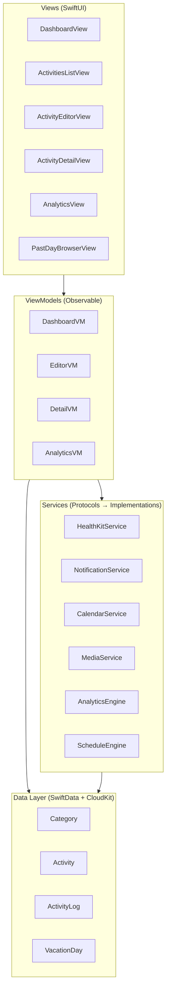
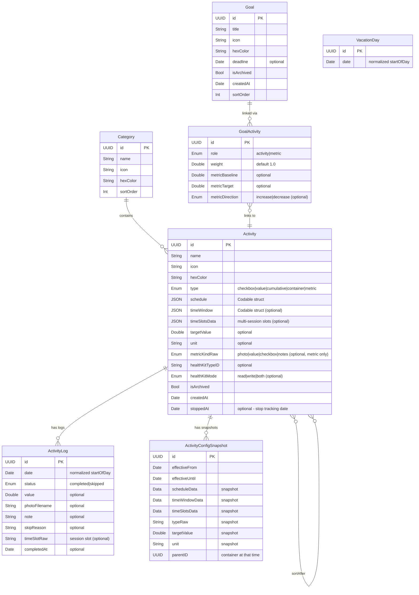

# Architecture & Data Model Design

## Architecture Overview: MVVM + Services



**Why MVVM + Services?**
- **Views** are pure SwiftUI — no business logic.
- **ViewModels** orchestrate data and services for each screen.
- **Services** are protocol-based, injectable, testable, and decoupled from both Views and each other.
- **Data Layer** is accessed via SwiftData `ModelContext` — passed through environment.

---

## Entity-Relationship Model



---

## Key Types (Codable Structs & Enums)

### ActivityType
```swift
enum ActivityType: String, Codable {
    case checkbox    // tap to complete
    case value       // log number + unit
    case cumulative  // multiple logs/day summing to target
    case container   // derived from children
}
```

### Schedule
```swift
struct Schedule: Codable {
    let type: ScheduleType    // daily, weekly, monthly, sticky, adhoc
    let weekdays: [Int]?      // 1=Mon..7=Sun (weekly)
    let monthDays: [Int]?     // 1..31 (monthly)
    let specificDate: Date?   // (adhoc)
}
```

> [!NOTE]
> `Schedule` is stored as a `Codable` JSON blob inside the Activity, not as a separate table. For a personal app with < 200 activities, filtering in-memory is efficient and avoids complex join queries.

### TimeWindow
```swift
struct TimeWindow: Codable {
    let slot: TimeSlot        // .morning, .afternoon, .evening, .custom
    let customStart: DateComponents?
    let customEnd: DateComponents?
}
```

### ReminderPreset
```swift
enum ReminderPreset: Codable {
    case remindAt(hour: Int, minute: Int)
    case morningNudge           // 8 AM if not started
    case eveningCheckIn         // 8 PM if < 50%
    case periodic(hours: Int)   // every N hrs if behind
    case none
}
```

---

## Services (Protocol-Based)

| Service                 | Responsibility                                 | Dependency          |
| ----------------------- | ---------------------------------------------- | ------------------- |
| **ScheduleEngine**      | `shouldShow(activity, on: date) → Bool`        | Activity, Calendar  |
| **AnalyticsEngine**     | Streaks, scores, heatmap data, insight summary | ActivityLog         |
| **HealthKitService**    | Read/write HK, observe changes                 | HealthKit framework |
| **NotificationService** | Schedule/cancel local notifications            | UserNotifications   |
| **CalendarService**     | Create/read EventKit events                    | EventKit            |
| **MediaService**        | Save/load photos, cleanup orphans              | FileManager         |

Each service is defined as a **protocol** with a concrete implementation. ViewModels receive services via init injection → easily mockable for tests.

```swift
// Example
protocol HealthKitServiceProtocol {
    func requestAuthorization() async throws
    func fetchTodayValue(for type: HKQuantityTypeIdentifier) async throws -> Double
    func write(value: Double, for type: HKQuantityTypeIdentifier, at date: Date) async throws
    func observeChanges(for type: HKQuantityTypeIdentifier, handler: @escaping (Double) -> Void)
}
```

---

## Project Structure

```
daily-activity-tracker/
├── docs/
│   └── REQUIREMENTS.md
│   └── ARCHITECTURE.md          ← This document
│   └── DATA_FORMAT.md           ← JSON Import/Export Schema
├── daily-activity-tracker/
│   ├── App/
│   │   └── DailyActivityTrackerApp.swift
│   ├── Models/
│   │   ├── Activity.swift
│   │   ├── ActivityLog.swift
│   │   ├── Category.swift
│   │   ├── VacationDay.swift
│   │   └── Types/               ← Codable enums/structs
│   │       ├── ActivityType.swift
│   │       ├── Schedule.swift
│   │       ├── TimeWindow.swift
│   │       └── ReminderPreset.swift
│   ├── Services/
│   │   ├── ScheduleEngine.swift
│   │   ├── AnalyticsEngine.swift
│   │   ├── HealthKitService.swift
│   │   ├── NotificationService.swift
│   │   ├── CalendarService.swift
│   │   └── MediaService.swift
│   ├── ViewModels/
│   │   ├── DashboardViewModel.swift
│   │   ├── ActivityEditorViewModel.swift
│   │   ├── ActivityDetailViewModel.swift
│   │   └── AnalyticsViewModel.swift
│   ├── Views/
│   │   ├── Dashboard/
│   │   │   ├── DashboardView.swift
│   │   │   ├── TimeBucketSection.swift
│   │   │   ├── AllDaySection.swift
│   │   │   └── EncouragementBar.swift
│   │   ├── Editor/
│   │   │   └── ActivityEditorView.swift
│   │   ├── Detail/
│   │   │   ├── ActivityDetailView.swift
│   │   │   ├── HeatmapView.swift
│   │   │   └── ValueChartView.swift
│   │   ├── Activities/
│   │   │   └── ActivitiesListView.swift
│   │   ├── Analytics/
│   │   │   ├── AnalyticsView.swift
│   │   │   ├── ActivityAnalyticsView.swift
│   │   │   ├── BarChartView.swift
│   │   │   ├── InsightSummaryCard.swift
│   │   │   ├── HeatmapView.swift
│   │   │   └── ValueChartView.swift
│   │   ├── Browser/
│   │   │   └── PastDayBrowserView.swift
│   │   └── Components/
│   │       ├── ProgressRing.swift
│   │       ├── CameraView.swift
│   │       ├── PhotoTimelineView.swift
│   │       └── ActivityRow.swift
│   └── Utils/
│       ├── Date+Extensions.swift
│       └── Color+Hex.swift
```

---

## Architecture Decision Records

### ADR-1: SwiftData over CoreData
**Decision**: Use SwiftData (iOS 17+).
**Rationale**: Less boilerplate, `@Model` macro, native CloudKit sync, Swift-native. Tradeoff: iOS 17+ minimum.

### ADR-2: Schedule as Codable JSON, not a Separate Table
**Decision**: Store `Schedule`, `TimeWindow`, `ReminderPreset` as Codable properties.
**Rationale**: Avoids join tables for a personal app. Filtering ~200 activities in memory is negligible. Makes the schema simpler and more flexible to extend (add a new schedule type = add an enum case, no migration).

### ADR-3: Photos in FileManager, Paths in SwiftData
**Decision**: Save images to `Documents/ActivityPhotos/{activityID}/{date}.jpg`. Store filename in `ActivityLog.photoFilename`.
**Rationale**: Avoids bloating the SwiftData store. CloudKit has payload limits; large binaries are better synced via CloudKit Assets separately or excluded from sync.

### ADR-4: Dependency Ordering via Soft References
**Decision**: Activity has an optional `sortAfter` relationship to another Activity.
**Rationale**: More resilient than absolute position numbers. Adding/removing activities doesn't require re-indexing. Topological sort at query time is trivial for ~20 items per time window.

### ADR-5: Protocol-Based Services
**Decision**: Every service is a protocol with a concrete implementation.
**Rationale**: Enables unit testing with mocks, supports future swapping (e.g., different notification strategies), keeps ViewModels testable without real HealthKit/EventKit.

### ADR-6: Multi-Session via TimeSlots Array
**Decision**: Store `[TimeSlot]` as `timeSlotsData` on Activity, add `timeSlotRaw` to ActivityLog.
**Rationale**: Keeps backward compatibility (single-session activities have `timeSlotsData = nil`). Dashboard expands multi-session activities into one row per slot. Each completion/skip log records its slot. This is more flexible than cloning activities per session.

### ADR-7: Config Snapshots for Non-Retroactive Edits
**Decision**: When a user edits structural fields (schedule, type, time window, target, parent) and chooses "Future Only", the current config is saved as an `ActivityConfigSnapshot` with date range. Analytics uses the snapshot for historical dates.
**Rationale**: Avoids cloning activities (which breaks relationships and creates identity problems). Snapshots are lightweight, backward-compatible (no snapshots = current behavior), and compose well with the existing model. `stoppedAt` on Activity handles the "stop doing it" case.

### ADR-8: Metrics as Activities
**Decision**: Goals are linked to Activities via `GoalActivity` junction table with a `role` field (`.activity` for contributing habits, `.metric` for outcome measurements). Metric config (baseline, target, direction) lives on the GoalActivity link, not on the Goal. GoalMeasurement was removed — measurements are just ActivityLog entries on metric-role activities. A goal can have up to 5 metrics.
**Rationale**: Measuring something (body fat, deadhang time) IS an activity you schedule and track. The existing `ActivityLog` already captures values (numeric), photos (visual progress), and completion status (boolean milestones). Duplicating this with a separate GoalMeasurement model was unnecessary complexity. This design also means metric activities get consistency tracking for free ("did you actually measure this week?").

### ADR-9: Activity Model Simplification
**Decision**: Removed `allowsPhoto`, `photoCadenceRaw`, `allowsNotes`, `reminderData`, and `weight` from `Activity`. Added `.metric` to `ActivityType` with a `MetricKind` enum (photo, value, checkbox, notes). Photo tracking is now a metric activity with `metricKind == .photo`. Per-activity reminders removed in favor of global notifications (Phase 2). Container children use equal weighting.
**Rationale**: The old composable-inputs approach (`allowsPhoto + photoCadence + allowsNotes`) created a combinatorial explosion of UI states. With metrics-as-activities, photo tracking is just another metric kind. Activity-level weight was rarely used and conflated with goal-level weighting. Per-activity reminders had low engagement; global day-part nudges are more effective.

### ADR-10: Smart Appearance Auto-Pick
**Decision**: `ActivityAppearance` service uses a curated keyword→(icon, color) dictionary (100+ entries) to auto-suggest icon and color from the activity name. Manual override is available via a `DisclosureGroup` at the bottom of the form. Editing an existing activity disables auto-suggest.
**Rationale**: Reduces friction during activity creation — users rarely care about icons. Keyword matching is simple, zero-latency, and covers 90%+ of common activity names. The `DisclosureGroup` keeps the manual option accessible without cluttering the primary creation flow.

### ADR-11: Container Multi-Session Expansion
**Decision**: Containers appear in each time slot where they have applicable children. `ContainerRowView` accepts a `slotFilter` parameter to show only children active in that slot. `groupedBySlot` expands containers by iterating over slots and checking children's time windows.
**Rationale**: A container like "Morning Routine" with children in both morning and evening slots must show in both buckets. Without expansion, the container only appeared in one slot (defaulting to morning), hiding evening children.

### ADR-12: Global Day-Part Notifications
**Decision**: Replaced per-activity `ReminderPreset` with three global day-part reminders (morning/afternoon/evening) stored in `UserDefaults`. Each has an enable toggle and configurable time. Configured in `SettingsView`.
**Rationale**: Per-activity reminders had low engagement and added setup friction. Global day-part nudges are simpler, more effective, and don't require activity-level configuration.

### ADR-13: Container Goal-Linking
**Decision**: Containers can be linked to goals in the `.activity` (habit) role only. Container consistency = fraction of scheduled days where ALL non-archived children have completion logs. Containers cannot be metrics.
**Rationale**: A container like "Workout Routine" represents a unit of work — if all exercises are done, the routine is complete. Individual children can also be linked separately as metrics if needed.

---

## Phased Implementation Strategy

| Phase                | Scope                                                                           | Deliverable                                          |
| -------------------- | ------------------------------------------------------------------------------- | ---------------------------------------------------- |
| **P0: Foundation**   | Models, ScheduleEngine, Dashboard (Checkbox only)                               | Working today-view with tap-to-complete              |
| **P1: Rich Types**   | Value, Cumulative, Container hierarchy, partial scoring                         | All activity types functional                        |
| **P2: Photos**       | MediaService, CameraView (ghost), PhotoTimeline                                 | Photo capture and review                             |
| **P3: Analytics**    | InsightSummaryCard, Heatmap, ValueChart, streaks, behind schedule, biggest wins | Activity-focused analytics and habit insights        |
| **P4: Integrations** | HealthKit, Notifications, EventKit                                              | External system connections                          |
| **P5: Polish**       | Past-day browser, vacation mode, haptics, undo                                  | Full UX refinement including editing, deleting, etc. |
