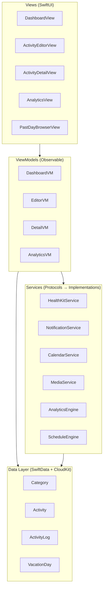
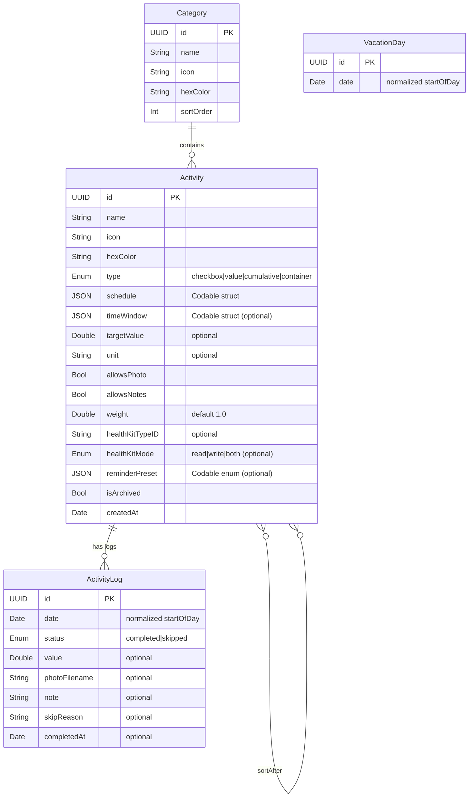

# Architecture & Data Model Design

## Architecture Overview: MVVM + Services



**Why MVVM + Services?**
- **Views** are pure SwiftUI — no business logic.
- **ViewModels** orchestrate data and services for each screen.
- **Services** are protocol-based, injectable, testable, and decoupled from both Views and each other.
- **Data Layer** is accessed via SwiftData `ModelContext` — passed through environment.

---

## Entity-Relationship Model



---

## Key Types (Codable Structs & Enums)

### ActivityType
```swift
enum ActivityType: String, Codable {
    case checkbox    // tap to complete
    case value       // log number + unit
    case cumulative  // multiple logs/day summing to target
    case container   // derived from children
}
```

### Schedule
```swift
struct Schedule: Codable {
    let type: ScheduleType    // daily, weekly, monthly, sticky, adhoc
    let weekdays: [Int]?      // 1=Mon..7=Sun (weekly)
    let monthDays: [Int]?     // 1..31 (monthly)
    let specificDate: Date?   // (adhoc)
}
```

> [!NOTE]
> `Schedule` is stored as a `Codable` JSON blob inside the Activity, not as a separate table. For a personal app with < 200 activities, filtering in-memory is efficient and avoids complex join queries.

### TimeWindow
```swift
struct TimeWindow: Codable {
    let slot: TimeSlot        // .morning, .afternoon, .evening, .custom
    let customStart: DateComponents?
    let customEnd: DateComponents?
}
```

### ReminderPreset
```swift
enum ReminderPreset: Codable {
    case remindAt(hour: Int, minute: Int)
    case morningNudge           // 8 AM if not started
    case eveningCheckIn         // 8 PM if < 50%
    case periodic(hours: Int)   // every N hrs if behind
    case none
}
```

---

## Services (Protocol-Based)

| Service | Responsibility | Dependency |
|---------|---------------|------------|
| **ScheduleEngine** | `shouldShow(activity, on: date) → Bool` | Activity, Calendar |
| **AnalyticsEngine** | Streaks, scores, heatmap data, encouragement | ActivityLog |
| **HealthKitService** | Read/write HK, observe changes | HealthKit framework |
| **NotificationService** | Schedule/cancel local notifications | UserNotifications |
| **CalendarService** | Create/read EventKit events | EventKit |
| **MediaService** | Save/load photos, cleanup orphans | FileManager |

Each service is defined as a **protocol** with a concrete implementation. ViewModels receive services via init injection → easily mockable for tests.

```swift
// Example
protocol HealthKitServiceProtocol {
    func requestAuthorization() async throws
    func fetchTodayValue(for type: HKQuantityTypeIdentifier) async throws -> Double
    func write(value: Double, for type: HKQuantityTypeIdentifier, at date: Date) async throws
    func observeChanges(for type: HKQuantityTypeIdentifier, handler: @escaping (Double) -> Void)
}
```

---

## Project Structure

```
daily-activity-tracker/
├── docs/
│   └── REQUIREMENTS.md
│   └── ARCHITECTURE.md          ← This document
├── daily-activity-tracker/
│   ├── App/
│   │   └── DailyActivityTrackerApp.swift
│   ├── Models/
│   │   ├── Activity.swift
│   │   ├── ActivityLog.swift
│   │   ├── Category.swift
│   │   ├── VacationDay.swift
│   │   └── Types/               ← Codable enums/structs
│   │       ├── ActivityType.swift
│   │       ├── Schedule.swift
│   │       ├── TimeWindow.swift
│   │       └── ReminderPreset.swift
│   ├── Services/
│   │   ├── ScheduleEngine.swift
│   │   ├── AnalyticsEngine.swift
│   │   ├── HealthKitService.swift
│   │   ├── NotificationService.swift
│   │   ├── CalendarService.swift
│   │   └── MediaService.swift
│   ├── ViewModels/
│   │   ├── DashboardViewModel.swift
│   │   ├── ActivityEditorViewModel.swift
│   │   ├── ActivityDetailViewModel.swift
│   │   └── AnalyticsViewModel.swift
│   ├── Views/
│   │   ├── Dashboard/
│   │   │   ├── DashboardView.swift
│   │   │   ├── TimeBucketSection.swift
│   │   │   ├── AllDaySection.swift
│   │   │   └── EncouragementBar.swift
│   │   ├── Editor/
│   │   │   └── ActivityEditorView.swift
│   │   ├── Detail/
│   │   │   ├── ActivityDetailView.swift
│   │   │   ├── HeatmapView.swift
│   │   │   └── ValueChartView.swift
│   │   ├── Analytics/
│   │   │   └── GlobalAnalyticsView.swift
│   │   ├── Browser/
│   │   │   └── PastDayBrowserView.swift
│   │   └── Components/
│   │       ├── ProgressRing.swift
│   │       ├── CameraView.swift
│   │       ├── PhotoTimelineView.swift
│   │       └── ActivityRow.swift
│   └── Utils/
│       ├── Date+Extensions.swift
│       └── Color+Hex.swift
```

---

## Architecture Decision Records

### ADR-1: SwiftData over CoreData
**Decision**: Use SwiftData (iOS 17+).
**Rationale**: Less boilerplate, `@Model` macro, native CloudKit sync, Swift-native. Tradeoff: iOS 17+ minimum.

### ADR-2: Schedule as Codable JSON, not a Separate Table
**Decision**: Store `Schedule`, `TimeWindow`, `ReminderPreset` as Codable properties.
**Rationale**: Avoids join tables for a personal app. Filtering ~200 activities in memory is negligible. Makes the schema simpler and more flexible to extend (add a new schedule type = add an enum case, no migration).

### ADR-3: Photos in FileManager, Paths in SwiftData
**Decision**: Save images to `Documents/ActivityPhotos/{activityID}/{date}.jpg`. Store filename in `ActivityLog.photoFilename`.
**Rationale**: Avoids bloating the SwiftData store. CloudKit has payload limits; large binaries are better synced via CloudKit Assets separately or excluded from sync.

### ADR-4: Dependency Ordering via Soft References
**Decision**: Activity has an optional `sortAfter` relationship to another Activity.
**Rationale**: More resilient than absolute position numbers. Adding/removing activities doesn't require re-indexing. Topological sort at query time is trivial for ~20 items per time window.

### ADR-5: Protocol-Based Services
**Decision**: Every service is a protocol with a concrete implementation.
**Rationale**: Enables unit testing with mocks, supports future swapping (e.g., different notification strategies), keeps ViewModels testable without real HealthKit/EventKit.

---

## Phased Implementation Strategy

| Phase | Scope | Deliverable |
|-------|-------|-------------|
| **P0: Foundation** | Models, ScheduleEngine, Dashboard (Checkbox only) | Working today-view with tap-to-complete |
| **P1: Rich Types** | Value, Cumulative, Container hierarchy, partial scoring | All activity types functional |
| **P2: Photos** | MediaService, CameraView (ghost), PhotoTimeline | Photo capture and review |
| **P3: Analytics** | Heatmap, ValueChart, EncouragementBar, streaks | Per-activity and global analytics |
| **P4: Integrations** | HealthKit, Notifications, EventKit | External system connections |
| **P5: Polish** | Past-day browser, vacation mode, haptics, undo | Full UX refinement |
