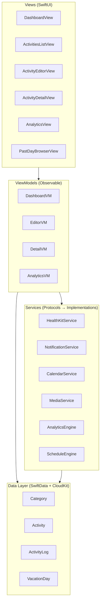
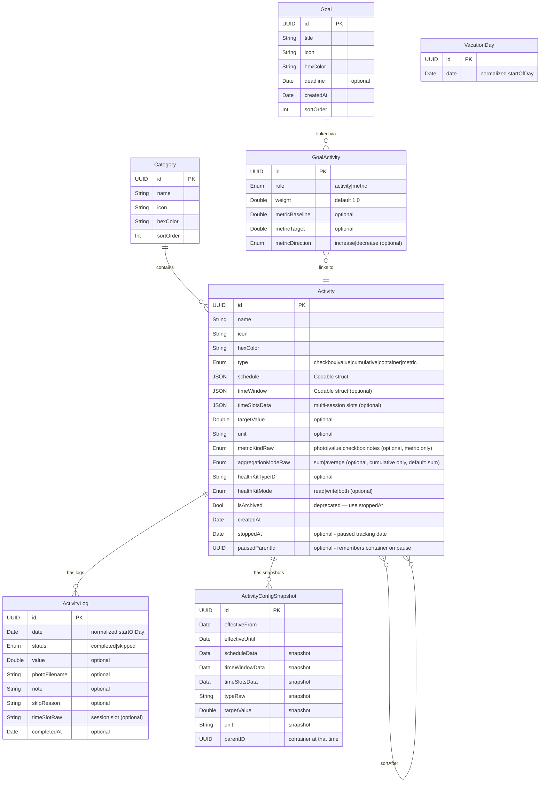

# Architecture & Data Model Design

## Architecture Overview: MVVM + Services



**Why MVVM + Services?**
- **Views** are pure SwiftUI — no business logic.
- **ViewModels** orchestrate data and services for each screen.
- **Services** are protocol-based, injectable, testable, and decoupled from both Views and each other.
- **Data Layer** is accessed via SwiftData `ModelContext` — passed through environment.

---

## Entity-Relationship Model



---

## Key Types (Codable Structs & Enums)

### ActivityType
```swift
enum ActivityType: String, Codable {
    case checkbox    // tap to complete
    case value       // log number + unit
    case cumulative  // multiple logs/day, aggregated via sum or average
    case container   // derived from children
}
```

### Schedule
```swift
struct Schedule: Codable {
    let type: ScheduleType    // daily, weekly, monthly, sticky, adhoc
    let weekdays: [Int]?      // 1=Mon..7=Sun (weekly)
    let monthDays: [Int]?     // 1..31 (monthly)
    let specificDate: Date?   // (adhoc)
}
```

> [!NOTE]
> `Schedule` is stored as a `Codable` JSON blob inside the Activity, not as a separate table. For a personal app with < 200 activities, filtering in-memory is efficient and avoids complex join queries.

> [!IMPORTANT]
> `sticky` and `adhoc` schedule types are treated as **reminders**, not goals. They are:
> - Shown in a separate "Reminders" section in the Activities list
> - Labeled "REMINDERS" on the Dashboard (not counted towards completion)
> - Excluded from Analytics (streaks, behind schedule, trends)

### TimeWindow
```swift
struct TimeWindow: Codable {
    let slot: TimeSlot        // .morning, .afternoon, .evening, .custom
    let customStart: DateComponents?
    let customEnd: DateComponents?
}
```

### ReminderPreset
```swift
enum ReminderPreset: Codable {
    case remindAt(hour: Int, minute: Int)
    case morningNudge           // 8 AM if not started
    case eveningCheckIn         // 8 PM if < 50%
    case periodic(hours: Int)   // every N hrs if behind
    case none
}
```

---

## Services (Protocol-Based)

| Service                   | Responsibility                                                                                                                                      | Dependency                      |
| ------------------------- | --------------------------------------------------------------------------------------------------------------------------------------------------- | ------------------------------- |
| **ScheduleEngine**        | `shouldShow`, `activitiesForToday`, carry-forward, `completionRate`, `currentStreak`, `longestStreak`, `isContainerCompleted`, `applicableChildren` | Activity, ActivityLog, Calendar |
| **ActivityStatusService** | Daily status queries: `isFullyCompleted`, `isSkipped`, `isSessionCompleted`, `isSessionSkipped`, `completionFraction`, `skipReason`, vacation check | ActivityLog, ScheduleEngine     |
| **AnalyticsEngine**       | Streaks, scores, heatmap data, insight summary                                                                                                      | ActivityLog                     |
| **HealthKitService**      | Read/write HK, observe changes                                                                                                                      | HealthKit framework             |
| **NotificationService**   | Schedule/cancel local notifications                                                                                                                 | UserNotifications               |
| **CalendarService**       | Create/read EventKit events                                                                                                                         | EventKit                        |
| **MediaService**          | Save/load photos, cleanup orphans                                                                                                                   | FileManager                     |

Each service is defined as a **protocol** with a concrete implementation. ViewModels receive services via init injection → easily mockable for tests.

```swift
// Example
protocol HealthKitServiceProtocol {
    func requestAuthorization() async throws
    func fetchTodayValue(for type: HKQuantityTypeIdentifier) async throws -> Double
    func write(value: Double, for type: HKQuantityTypeIdentifier, at date: Date) async throws
    func observeChanges(for type: HKQuantityTypeIdentifier, handler: @escaping (Double) -> Void)
}
```

---

## Project Structure

```
daily-activity-tracker/
├── docs/
│   └── REQUIREMENTS.md
│   └── ARCHITECTURE.md          ← This document
│   └── DATA_FORMAT.md           ← JSON Import/Export Schema
├── daily-activity-tracker/
│   ├── App/
│   │   └── DailyActivityTrackerApp.swift
│   ├── Models/
│   │   ├── Activity.swift
│   │   ├── ActivityLog.swift
│   │   ├── Category.swift
│   │   ├── VacationDay.swift
│   │   └── Types/               ← Codable enums/structs
│   │       ├── ActivityType.swift
│   │       ├── Schedule.swift
│   │       ├── TimeWindow.swift
│   │       └── ReminderPreset.swift
│   ├── Services/
│   │   ├── ScheduleEngine.swift
│   │   ├── ActivityStatusService.swift
│   │   ├── AnalyticsEngine.swift
│   │   ├── HealthKitService.swift
│   │   ├── NotificationService.swift
│   │   ├── CalendarService.swift
│   │   └── MediaService.swift
│   ├── ViewModels/
│   │   ├── DashboardViewModel.swift
│   │   ├── ActivityEditorViewModel.swift
│   │   ├── ActivityDetailViewModel.swift
│   │   └── AnalyticsViewModel.swift
│   ├── Views/
│   │   ├── Dashboard/
│   │   │   ├── DashboardView.swift
│   │   │   ├── TimeBucketSection.swift
│   │   │   ├── AllDaySection.swift
│   │   │   └── EncouragementBar.swift
│   │   ├── Editor/
│   │   │   └── ActivityEditorView.swift
│   │   ├── Detail/
│   │   │   ├── ActivityDetailView.swift
│   │   │   ├── HeatmapView.swift
│   │   │   └── ValueChartView.swift
│   │   ├── Activities/
│   │   │   └── ActivitiesListView.swift
│   │   ├── Analytics/
│   │   │   ├── AnalyticsView.swift
│   │   │   ├── ActivityAnalyticsView.swift
│   │   │   ├── BarChartView.swift
│   │   │   ├── InsightSummaryCard.swift
│   │   │   ├── PhotoComparisonCard.swift
│   │   │   ├── HeatmapView.swift
│   │   │   └── ValueChartView.swift
│   │   ├── Browser/
│   │   │   └── PastDayBrowserView.swift
│   │   └── Components/
│   │       ├── ProgressRing.swift
│   │       ├── CameraView.swift
│   │       ├── PhotoTimelineView.swift
│   │       └── ActivityRow.swift
│   └── Utils/
│       ├── Date+Extensions.swift
│       ├── Color+Hex.swift        ← also has Double.cleanDisplay
│       └── SharedConstants.swift   ← SkipReasons.defaults, scoreColor()
```

---

## Architecture Decision Records

### ADR-1: SwiftData over CoreData
**Decision**: Use SwiftData (iOS 17+).
**Rationale**: Less boilerplate, `@Model` macro, native CloudKit sync, Swift-native. Tradeoff: iOS 17+ minimum.

### ADR-2: Schedule as Codable JSON, not a Separate Table
**Decision**: Store `Schedule`, `TimeWindow`, `ReminderPreset` as Codable properties.
**Rationale**: Avoids join tables for a personal app. Filtering ~200 activities in memory is negligible. Makes the schema simpler and more flexible to extend (add a new schedule type = add an enum case, no migration).

### ADR-3: Photos in FileManager, Paths in SwiftData
**Decision**: Save images to `Documents/ActivityPhotos/{activityID}/{date}.{heic|jpg}`. Store filename in `ActivityLog.photoFilename`. User chooses format (HEIC default, JPEG) and capture resolution (1080p/2K/4K/Original, default 4K) in Photo Bank settings.
**Rationale**: Avoids bloating the SwiftData store. HEIC offers ~40% smaller files vs JPEG at similar quality. Both formats are read-compatible, so switching the setting doesn't break existing photos. CloudKit has payload limits; large binaries are better synced via CloudKit Assets separately or excluded from sync.

### ADR-4: Dependency Ordering via Soft References
**Decision**: Activity has an optional `sortAfter` relationship to another Activity.
**Rationale**: More resilient than absolute position numbers. Adding/removing activities doesn't require re-indexing. Topological sort at query time is trivial for ~20 items per time window.

### ADR-5: Protocol-Based Services
**Decision**: Every service is a protocol with a concrete implementation.
**Rationale**: Enables unit testing with mocks, supports future swapping (e.g., different notification strategies), keeps ViewModels testable without real HealthKit/EventKit.

### ADR-6: Multi-Session via TimeSlots Array
**Decision**: Store `[TimeSlot]` as `timeSlotsData` on Activity, add `timeSlotRaw` to ActivityLog.
**Rationale**: Keeps backward compatibility (single-session activities have `timeSlotsData = nil`). Dashboard expands multi-session activities into one row per slot. Each completion/skip log records its slot. This is more flexible than cloning activities per session.

### ADR-7: Config Snapshots for Non-Retroactive Edits
**Decision**: When a user edits structural fields (schedule, type, time window, target, parent) and chooses "Future Only", the current config is saved as an `ActivityConfigSnapshot` with date range. Analytics uses the snapshot for historical dates.
**Rationale**: Avoids cloning activities (which breaks relationships and creates identity problems). Snapshots are lightweight, backward-compatible (no snapshots = current behavior), and compose well with the existing model. `stoppedAt` on Activity handles the "stop doing it" case.

### ADR-8: Metrics as Activities
**Decision**: Goals are linked to Activities via `GoalActivity` junction table with a `role` field (`.activity` for contributing habits, `.metric` for outcome measurements). Metric config (baseline, target, direction) lives on the GoalActivity link, not on the Goal. GoalMeasurement was removed — measurements are just ActivityLog entries on metric-role activities. A goal can have up to 5 metrics.
**Rationale**: Measuring something (body fat, deadhang time) IS an activity you schedule and track. The existing `ActivityLog` already captures values (numeric), photos (visual progress), and completion status (boolean milestones). Duplicating this with a separate GoalMeasurement model was unnecessary complexity. This design also means metric activities get consistency tracking for free ("did you actually measure this week?").

### ADR-14: Goal On-Hold Status
**Decision**: A goal is automatically "On Hold" when it has metric links but ALL metric activities are paused/stopped (`isStopped`). On-hold goals display a grayed-out card with "ON HOLD" badge, consistency score shows "—", and a banner appears in the detail view. Paused individual activities show "(Paused)" badges throughout goals UI. Reminder-type activities (sticky/adhoc) are excluded from goal linking entirely. `consistencyScore` skips stopped activities. When a container linked to a goal is dissolved, its goal links are transferred to each child activity (same role/weight), and the container's link is removed.
**Rationale**: Goals should reflect the state of their underlying activities. If all metrics are paused, the goal has no active tracking mechanism and should signal this to the user rather than showing stale data. Excluding reminders from goals maintains the separation between "things you want to achieve" (goals) and "things you want to remember" (reminders). Dissolving a container should not silently break goal tracking — transferring links preserves the goal's contributing activities.

### ADR-9: Activity Model Simplification
**Decision**: Removed `allowsPhoto`, `photoCadenceRaw`, `allowsNotes`, `reminderData`, and `weight` from `Activity`. Added `.metric` to `ActivityType` with a `MetricKind` enum (photo, value, checkbox, notes). Photo tracking is now a metric activity with `metricKind == .photo`. Per-activity reminders removed in favor of global notifications (Phase 2). Container children use equal weighting.
**Rationale**: The old composable-inputs approach (`allowsPhoto + photoCadence + allowsNotes`) created a combinatorial explosion of UI states. With metrics-as-activities, photo tracking is just another metric kind. Activity-level weight was rarely used and conflated with goal-level weighting. Per-activity reminders had low engagement; global day-part nudges are more effective.

### ADR-10: Smart Appearance Auto-Pick
**Decision**: `ActivityAppearance` service uses a curated keyword→(icon, color) dictionary (100+ entries) to auto-suggest icon and color from the activity name. Manual override is available via a `DisclosureGroup` at the bottom of the form. Editing an existing activity disables auto-suggest.
**Rationale**: Reduces friction during activity creation — users rarely care about icons. Keyword matching is simple, zero-latency, and covers 90%+ of common activity names. The `DisclosureGroup` keeps the manual option accessible without cluttering the primary creation flow.

### ADR-11: Container Multi-Session Expansion
**Decision**: Containers appear in each time slot where they have applicable children. `ContainerRowView` accepts a `slotFilter` parameter to show only children active in that slot. `groupedBySlot` expands containers by iterating over slots and checking children's time windows.
**Rationale**: A container like "Morning Routine" with children in both morning and evening slots must show in both buckets. Without expansion, the container only appeared in one slot (defaulting to morning), hiding evening children.

### ADR-12: Global Day-Part Notifications
**Decision**: Replaced per-activity `ReminderPreset` with three global day-part reminders (morning/afternoon/evening) stored in `UserDefaults`. Each has an enable toggle and configurable time. Configured in `SettingsView`.
**Rationale**: Per-activity reminders had low engagement and added setup friction. Global day-part nudges are simpler, more effective, and don't require activity-level configuration.

### ADR-13: Container Goal-Linking
**Decision**: Containers can be linked to goals in the `.activity` (habit) role only. Container consistency = fraction of scheduled days where ALL non-archived children have completion logs. Containers cannot be metrics.
**Rationale**: A container like "Workout Routine" represents a unit of work — if all exercises are done, the routine is complete. Individual children can also be linked separately as metrics if needed.

### ADR-14: Centralized Schedule Logic in ScheduleEngine
**Decision**: All completion rate, streak (current/longest), and container completion logic is centralized in `ScheduleEngine`. Views call `scheduleEngine.completionRate(for:days:logs:vacationDays:allActivities:)` and `scheduleEngine.currentStreak(for:...)` instead of implementing inline logic. `Schedule.isScheduled(on:)` replaces all inline `switch schedule.type` patterns.
**Rationale**: Before refactoring, identical 40-90 line schedule-checking, streak-computing, and completion-calculating logic was duplicated across 6+ view files (~540 lines total). This made bugs hard to fix consistently and new schedule types impossible to add without touching every file. Centralizing creates a single source of truth.

### ADR-15: ActivityStatusService for Daily Status Queries
**Decision**: All daily activity status queries (`isFullyCompleted`, `isSkipped`, `isSessionCompleted`, `isSessionSkipped`, `completionFraction`, `skipReason`, `latestValue`, `cumulativeValue`, vacation check) are centralized in `ActivityStatusService`. Views create a lightweight struct instance and delegate status queries to it.
**Rationale**: The same completion/skip logic was duplicated 3-4 times across DashboardView, ContainerRowView, ScheduleEngine, and GoalDetailView with subtly different semantics, causing recurring bugs (skip-in-progress-bar, carry-forward). `ActivityStatusService` is a value type (struct) that owns no state — it's constructed from the current date, logs, and activities, making it safe to recreate on every SwiftUI body evaluation. Container child resolution also centralized in `ScheduleEngine.applicableChildren(for:on:allActivities:logs:)`.

### ADR-16: Activity Management UX Enhancements
**Decision**: Added 6 interaction patterns to `ActivitiesListView`: (1) "Move to Container" context-menu submenu, (2) "Convert to Container" / "Dissolve Container" with config snapshots, (3) drag-and-drop reordering via `.onMove` + `EditButton`, (4) "Group into Container" multi-select, (5) type-picker-based inline quick-add, and streamlined `AddActivityView` with collapsible "More Options" for new activities.
**Rationale**: Activity organization required navigating the full form for even simple operations like reparenting or reordering. Context-menu actions, drag-and-drop, and multi-select reduce common workflows from 4+ steps to 1.
**Config snapshots**: Both Convert and Dissolve create `ActivityConfigSnapshot` records to preserve historical analytics when changing activity type.

### ADR-17: Consolidate Archived + Stopped → Single "Paused" Concept

**Status**: Accepted  
**Decision**: Merged `isArchived` and `stoppedAt` into a unified concept using only `stoppedAt`. Activities with `stoppedAt != nil` are considered "paused."

**Rationale**: The two-concept model was confusing — `isArchived` hid from UI completely while `stoppedAt` stopped scheduling. Users couldn't understand the difference. A single "Pause" action with `stoppedAt` date provides clear date-boundary semantics for analytics while removing activities from the active dashboard.

**Key behaviors**:
- **Pause**: Sets `stoppedAt = today`, stores `pausedParentId` (for children in containers), removes from parent
- **Resume**: Clears `stoppedAt`, restores parent from `pausedParentId` if container still exists  
- `isArchived` property kept in SwiftData schema for backward compatibility but deprecated
- DataService import handles legacy `isArchived=true` by setting `stoppedAt` if not already set
- DataService v2.0 adds export/import for workout domain: Exercise, ExerciseMuscle, MuscleGroup, WorkoutPlan, WorkoutPlanDay, StrengthPlanExercise, CardioPlanExercise, StrengthSession, WorkoutSetLog, CardioSession, CardioSessionLog. All new fields are optional for backward compatibility with v1.0 exports.

---

### ADR-18: Activity / Reminder Entity Separation

**Decision**: Separated reminders from activities in the creation flow. A top-level entity picker (Activity vs Reminder) determines which form is shown.

**Rationale**: Reminders are inherently simple — checkbox-type, no categories, no value/cumulative tracking, no time slots or HealthKit. Mixing them into the full activity creation flow was confusing and required users to navigate irrelevant options. Separating them simplifies both flows.

**Key behaviors**:
- **Entity picker**: Segmented control at form top (Activity / Reminder), default is Activity
- **Reminder form**: Only name, icon/color, and sticky-vs-date — everything else hidden
- **Activity form**: Full creation flow, but schedule section only shows recurring options (Daily/Weekly/Monthly)
- **Data model unchanged**: Reminders are still `Activity` objects with `.checkbox` type and `.sticky`/`.adhoc` schedule — the separation is purely at the UI layer
- **Edit detection**: Loading a sticky/adhoc activity auto-detects as reminder mode
- **Reminders section**: Always visible in ActivitiesListView with "+" add button, sorted by `createdDate` descending

---

### ADR-19: Generalized Carry Forward Toggle

**Decision**: Replaced the hardcoded metric-only carry forward behavior with a configurable `carryForward` Bool flag on the Activity model.

**Rationale**: Carry forward was useful beyond metrics — weekly/monthly value or cumulative activities also benefit from being reminded about missed occurrences. Making it configurable gives users control without changing the underlying mechanism.

**Key behaviors**:
- `carryForward: Bool = false` on Activity model — lightweight schema migration
- ScheduleEngine uses `activity.carryForward` instead of `activity.type == .metric`
- Toggle in AddActivityView advanced section, visible only for weekly/monthly non-container activities
- Metrics auto-default to `carryForward = true` on type selection and quick-create
- Existing metrics retain their behavior via the unchanged ScheduleEngine logic

---

### ADR-20: Carry Forward Logs on Original Date

**Decision**: When a carry-forwarded activity is completed or skipped, the log is recorded on the **original scheduled date**, not the current date.

**Rationale**: Logging on the original date means the ScheduleEngine naturally sees the missed occurrence as resolved and stops carrying it forward — no special cleanup logic needed. This keeps analytics, streaks, and completion rates accurate for the date the activity was actually due.

**Key behaviors**:
- `effectiveLogDate(for:)` returns the carry-forward original date or today
- `effectiveLogs(for:)` searches logs on the effective date for undo/uncomplete operations
- Visual treatment: light red row background + "⏳ Due from (Mon Day)" capsule label
- Applies to all log types: checkbox, value, cumulative, and skip

---

### ADR-18: Goal Pause Replaces Archive

**Decision**: Removed manual `isArchived` toggle from Goals. Goals are now automatically "paused" when ALL linked activities and metrics are stopped (paused). A computed `isPaused` property replaces the persisted `isArchived` field.

**Rationale**: Manual archiving was redundant — if all underlying activities are paused, the goal is inherently inactive. Deriving pause state from linked activities eliminates user confusion about the difference between "archived" and "on hold" goals, and ensures goal state stays consistent with activity state automatically.

**Implications**:
- `isArchived` removed from `Goal` SwiftData model (lightweight migration)
- `isOnHold` replaced by broader `isPaused` (checks both activity and metric links)
- `GoalsView` shows paused goals in a collapsible "Paused" section with grayscale full-size cards
- Export DTO keeps `isArchived: false` for backward compatibility
- Import ignores the `isArchived` field from legacy exports
- Clear Data now also deletes goals and goal-activity links

---

## Phased Implementation Strategy

| Phase                | Scope                                                                                                                           | Deliverable                                          |
| -------------------- | ------------------------------------------------------------------------------------------------------------------------------- | ---------------------------------------------------- |
| **P0: Foundation**   | Models, ScheduleEngine, Dashboard (Checkbox only)                                                                               | Working today-view with tap-to-complete              |
| **P1: Rich Types**   | Value, Cumulative, Container hierarchy, partial scoring                                                                         | All activity types functional                        |
| **P2: Photos**       | MediaService, CameraView (ghost, multi-slot), PhotoTimeline, PhotoBank                                                          | Photo capture with sequential multi-slot support     |
| **P3: Analytics**    | InsightSummaryCard, Heatmap, ValueChart, PhotoComparisonCard, streaks, behind schedule, biggest wins, photo progress, deep dive | Activity-focused analytics and habit insights        |
| **P4: Integrations** | HealthKit, Notifications, EventKit                                                                                              | External system connections                          |
| **P5: Polish**       | Past-day browser, vacation mode, haptics, undo                                                                                  | Full UX refinement including editing, deleting, etc. |
