# Workout Feature — Architecture

> See also: [REQUIREMENTS.md](file:///Users/sambhavgupta/Desktop/daily-activity-tracker/docs/workout_feature/REQUIREMENTS.md) · [IMPLEMENTATION_PLAN.md](file:///Users/sambhavgupta/Desktop/daily-activity-tracker/docs/workout_feature/IMPLEMENTATION_PLAN.md)

---

## System Overview

```mermaid
graph TB
    subgraph Dashboard["Dashboard (All Day section)"]
        SC["🏋️ Strength Training (container)"]
        SC --> PD["💪 PPL – Push ☐"]
        CC["🏃 Cardio (container)"]
        CC --> RD["🏃 Cardio – Run ☐"]
    end

    subgraph WorkoutTab["Workout Tab (5th)"]
        TW["Today's Workout"]
        MP["My Plans (drafts + active)"]
        EL["Exercise Library"]
        MG["Muscle Glossary"]
    end

    subgraph AnalyticsTab["Analytics Tab"]
        AA["Activities Analytics"]
        WA["Workout Analytics\n1RM · volume · PRs\npace · distance"]
    end

    subgraph Services["Services"]
        WPM["WorkoutPlanManager\nplan CRUD · shell sync\nvolume analysis · day-type detection"]
        SSM["StrengthSessionManager\nset logging · auto-completion"]
        CSM["CardioSessionManager\nGPS distance · HK sessions\nlive metrics · auto-completion"]
    end

    subgraph HK["HealthKit"]
        HKS["HKWorkoutSession\nHR · distance · pace\ncalories · cadence"]
    end

    PD -.->|"tap"| TW
    WPM -->|"creates/syncs shells"| SC
    SSM -->|"creates ActivityLog"| PD
    CSM -->|"creates ActivityLog"| RD
    CSM <-->|"live data"| HKS
```



---

## Design Principle: Shared Infrastructure, Separated Specializations

Strength and cardio share plan structure (`WorkoutPlan`, `WorkoutPlanDay`, `Exercise`) but everything type-specific lives in its own model. **No union types.**

---

## Service Responsibilities

### WorkoutPlanManager (shared)

- Plan CRUD — create, edit, activate, deactivate
- Shell activity sync — create/update/pause `Activity` shells with `Schedule.weekly([weekdays])`
- Volume analysis — compute effective sets per muscle, color-code against MEV/MAV/MRV
- Day-type auto-detection — classify days (Push/Pull/Legs etc.) by dominant muscle coverage
- Color linking propagation — replicate exercises across linked days (same `colorGroup`)

### StrengthSessionManager (strength-only)

- Session lifecycle — start, pause, resume, end
- Set logging — record reps + weight per set per exercise
- Auto-fill — suggest reps/weight from most recent session
- Auto-completion bridge — create `ActivityLog(.completed)` or `ActivityLog(.skipped)` on shell activity at session end
- 1RM calculation — Brzycki formula for analytics

### CardioSessionManager (cardio-only)

- HK workout builder — create/save workout via `HKWorkoutBuilder` with correct `HKWorkoutActivityType`
- Live metric queries — subscribe to `HKAnchoredObjectQuery` for real-time HR + distance
- Phase timer management — HIIT rounds, Tempo phases, Interval reps
- Auto-completion bridge — compare actual vs target, create `ActivityLog` on shell
- Session log creation — populate `CardioSessionLog` from accumulated live metrics

---

## Shell Activity ↔ ScheduleEngine Integration

> [!IMPORTANT]
> Shell activities use standard `Schedule.weekly()` so the existing `ScheduleEngine`, `completionStatus()`, heatmaps, and analytics all work **without modification**. The only new behavior is tap → Workout Tab routing and read-only enforcement.

Shell activities are real `Activity` objects:

| Property             | Value                                              |
| -------------------- | -------------------------------------------------- |
| Type                 | `.checkbox`                                        |
| Schedule             | `.weekly([weekdays])` — weekdays from plan         |
| TimeWindow           | `nil` — All Day section                            |
| Container            | Child of "Strength Training" or "Cardio" container |
| Name                 | `"{PlanName} – {DayLabel}"`                        |
| `isManagedByWorkout` | `true`                                             |

### Shell Schedule Sync

When a plan is saved, `WorkoutPlanManager` syncs shells:

```swift
func syncShellActivities(plan: WorkoutPlan) {
    // Group plan days by dayLabel (e.g. "Push" → [Mon=1, Fri=5])
    let labelToWeekdays = Dictionary(grouping: plan.days.filter { !$0.isRest }) { $0.dayLabel }
        .mapValues { $0.map(\.weekday) }

    for (label, weekdays) in labelToWeekdays {
        let shell = findOrCreateShell(plan: plan, label: label)
        shell.schedule = .weekly(weekdays)  // ScheduleEngine picks this up naturally
        shell.parent = containerActivity
        shell.isManagedByWorkout = true
    }
    // Remove shells for labels no longer in plan
    // Auto-complete rest day shells via ActivityLog(.completed)
}
```

### Plan Deactivation

```swift
func deactivatePlan(_ plan: WorkoutPlan) {
    plan.status = .inactive
    for shell in findShells(for: plan) {
        shell.stoppedAt = Date()  // Existing stopped-activity filtering hides them
    }
    // Container + history preserved — no deletion
}
```

### ActivityLog Timing

`ActivityLog` is created **at session end**, not during:

```
Session Start → no log exists → shell shows ☐ on dashboard
Session End → auto-completion check:
  ≥80% → ActivityLog(.completed) → shell shows ☑
  <80% → ActivityLog(.skipped, "Incomplete: X/Y sets") → shell shows skipped
```

`ScheduleEngine.completionStatus()` reads `ActivityLog` as normal — **no engine changes needed**.

---

## Data Model

### ER Diagram


### Session History Preservation

Sessions store **snapshot metadata** alongside optional live references:

```swift
@Model final class StrengthSession {
    // Snapshot (survives plan deletion)
    var planName: String          // "PPL Split"
    var dayLabel: String          // "Push"
    var weekday: Int              // 1=Mon
    // Optional live reference (nil after plan deletion)
    var planDay: WorkoutPlanDay?  // deleteRule: .nullify
    // ...
}
```

`WorkoutSetLog` references `Exercise` directly — exercises live independently in the library and are never cascade-deleted by plan operations.

### Color Linking

- `WorkoutPlanDay.colorGroup` (0–6): same value = linked days
- **Only empty days can be linked** — if day has exercises, prompt "Clear this day to link?"
- On any exercise add/edit/remove on a linked day, `WorkoutPlanManager` propagates to all days with same `colorGroup`
- Unlinking: tap color dot to cycle to a unique color → day becomes independent

### Cardio Session Params JSON Schemas

```swift
// SteadyState
struct SteadyStateParams: Codable { var targetHRZone: Int } // 1-5

// Tempo
struct TempoParams: Codable {
    var warmupMin: Int; var tempoMin: Int; var cooldownMin: Int; var targetHRZone: Int
}

// HIIT
struct HIITParams: Codable { var rounds: Int; var workSeconds: Int; var restSeconds: Int }

// Intervals
struct IntervalParams: Codable { var reps: Int; var distancePerRep: Double; var restSeconds: Int }

// Free — empty (no params needed)
```

---

## Edge Cases & Decisions

| Scenario                                        | Decision                                                                                                        |
| ----------------------------------------------- | --------------------------------------------------------------------------------------------------------------- |
| User changes plan (moves Push Mon→Tue)          | `syncShellActivities()` updates shell's `Schedule.weekly()`                                                     |
| User deactivates plan                           | Shell activities get `stoppedAt`, disappear from dashboard                                                      |
| User deletes plan                               | Same as deactivate — plan marked inactive, shells stopped. Data kept for history                                |
| Plan deleted but sessions exist                 | Sessions preserve snapshot data (`planName`, `dayLabel`). PlanDay ref nullified                                 |
| Multiple cardio exercises same day              | `CardioPlanExercise` array per day. Session tracks all exercises                                                |
| Session started but app killed                  | Session stays `inProgress`. Next launch → prompt resume or abandon                                              |
| HR zones without HealthKit data                 | Generic labels: "Zone 2", "Zone 3" — no BPM ranges                                                              |
| Exercise used in plan then deleted from library | Prompt user; remove from current plan. Sessions keep reference (exercise not cascade-deleted)                   |
| Two rest days in a row                          | Auto-complete each independently. No shells for rest days                                                       |
| Day auto-detection algo                         | Effective sets per muscle. Dominant group >60% = named (Push/Pull/Legs). Mixed = "Full Body" or "Upper"/"Lower" |
| Linked day edit propagation                     | After every exercise add/edit/remove, iterate all days with same colorGroup, replicate changes                  |
| Activating second plan of same type             | Auto-deactivate current, warn user                                                                              |
| Draft plan editing                              | Full editor access, no shell activities created until activation                                                |
